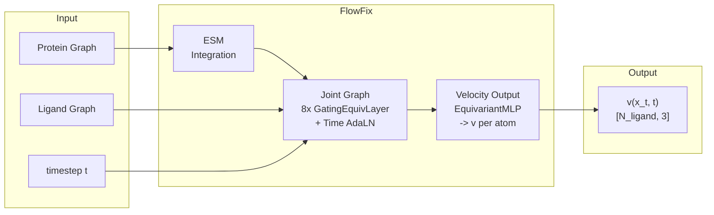

# FlowFix: SE(3)-Equivariant Flow Matching for Protein-Ligand Pose Refinement

FlowFix refines docked protein-ligand binding poses toward crystal structures using **SE(3)-equivariant flow matching** on a joint protein-ligand graph.

## Architecture



- **Joint graph**: Protein + ligand merged into a single graph with 4 edge types (PP, LL bonds, LL intra, PL cross)
- **SE(3)-equivariant**: cuEquivariance tensor products preserve rotational/translational symmetry
- **Flow matching**: Learns velocity field along linear interpolation path x_t = (1-t)\*x_0 + t\*x_1
- **Time conditioning**: Sinusoidal embedding + AdaLN in each of 8 message passing layers
- **ESM embeddings**: ESMC 600M + ESM3 weighted projection, gated concatenation to protein features

For detailed architecture diagrams, see [docs/ARCHITECTURE.md](docs/ARCHITECTURE.md).

## Results (v4 Baseline)

| Metric | Before | After | Change |
|--------|--------|-------|--------|
| Mean RMSD | 3.20 A | 2.64 A | -0.56 A |
| Median RMSD | 3.00 A | 2.22 A | -0.78 A |
| Success rate (<2A) | 30.4% | 44.6% | +14.2%p |
| Success rate (<1A) | 8.7% | 13.5% | +4.8%p |
| Improved poses | - | 75.2% | - |

Evaluated on 200 PDBs, 11,543 poses, 20-step Euler ODE with EMA weights.

## Directory Structure

```
src/
  models/          Model definitions (flowmatching, network, layers)
  data/            Dataset and featurization
  utils/           Training utilities, losses, sampling, logging
configs/           Training config YAMLs (see configs/README.md)
scripts/           Data preparation, analysis, SLURM scripts (see scripts/README.md)
docs/              Architecture docs, operation guides (see docs/README.md)
tests/             Tests
reports/           Progress reports and architecture diagrams
train.py           Training entry point (DDP multi-GPU support)
inference.py       Inference / evaluation entry point
```

## Setup

> PyTorch and PyG installation may vary depending on your GPU/driver/cluster environment.

```bash
conda create -n flowfix python=3.10 -y
conda activate flowfix

# Install PyTorch for your CUDA version first, then:
pip install -r requirements.txt
```

## Quick Start

### Training

```bash
python train.py --config configs/train_joint.yaml
```

### Multi-GPU Training (DDP)

```bash
python -m torch.distributed.run --standalone --nnodes=1 --nproc_per_node=8 \
  train.py --config configs/train_joint.yaml
```

### Inference

```bash
python inference.py \
  --config configs/train_rectified_flow_full.yaml \
  --checkpoint save/rectified-flow-full-v4/checkpoints/latest.pt \
  --device cuda
```

## Training Configuration (v4)

| Parameter | Value |
|-----------|-------|
| Architecture | Joint graph, 8 GatingEquivariantLayer |
| Hidden irreps | 192x0e + 48x1o + 48x1e (480d) |
| Cross-edge cutoff | 6.0 A, max 16 neighbors |
| Optimizer | Muon (lr=0.005) + AdamW (lr=3e-4) |
| Schedule | Warmup 5% + Plateau 80% + Cosine 15% |
| Loss | Velocity MSE + distance geometry (0.1) |
| EMA | decay=0.999 |
| Batch size | 32, 500 epochs |

## Documentation

- [Architecture](docs/ARCHITECTURE.md) - Detailed model architecture with Mermaid diagrams
- [Progress Report](reports/progress.md) - Training results and analysis
