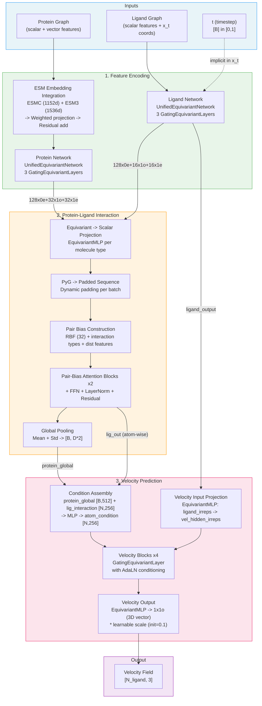
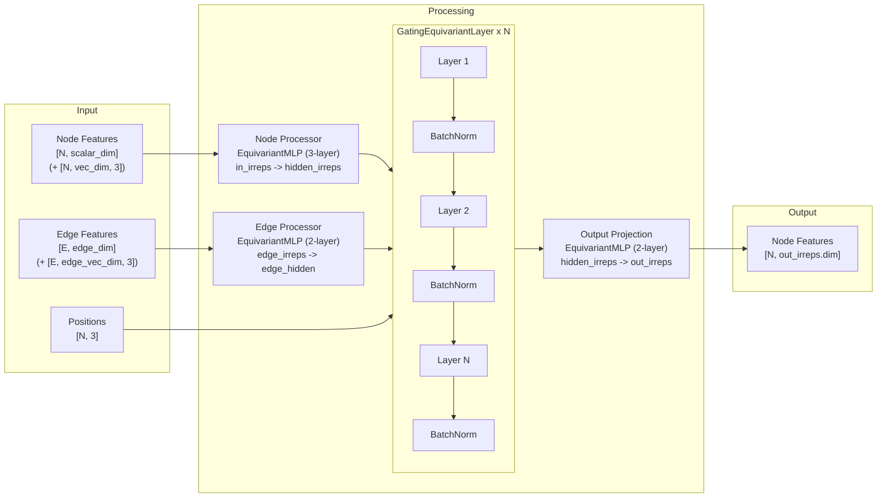
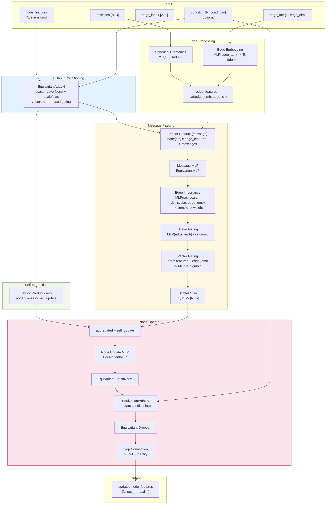
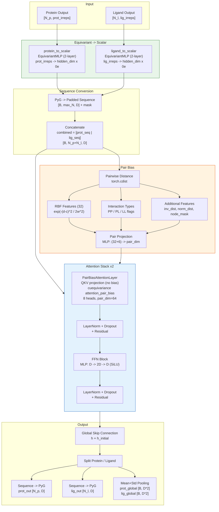
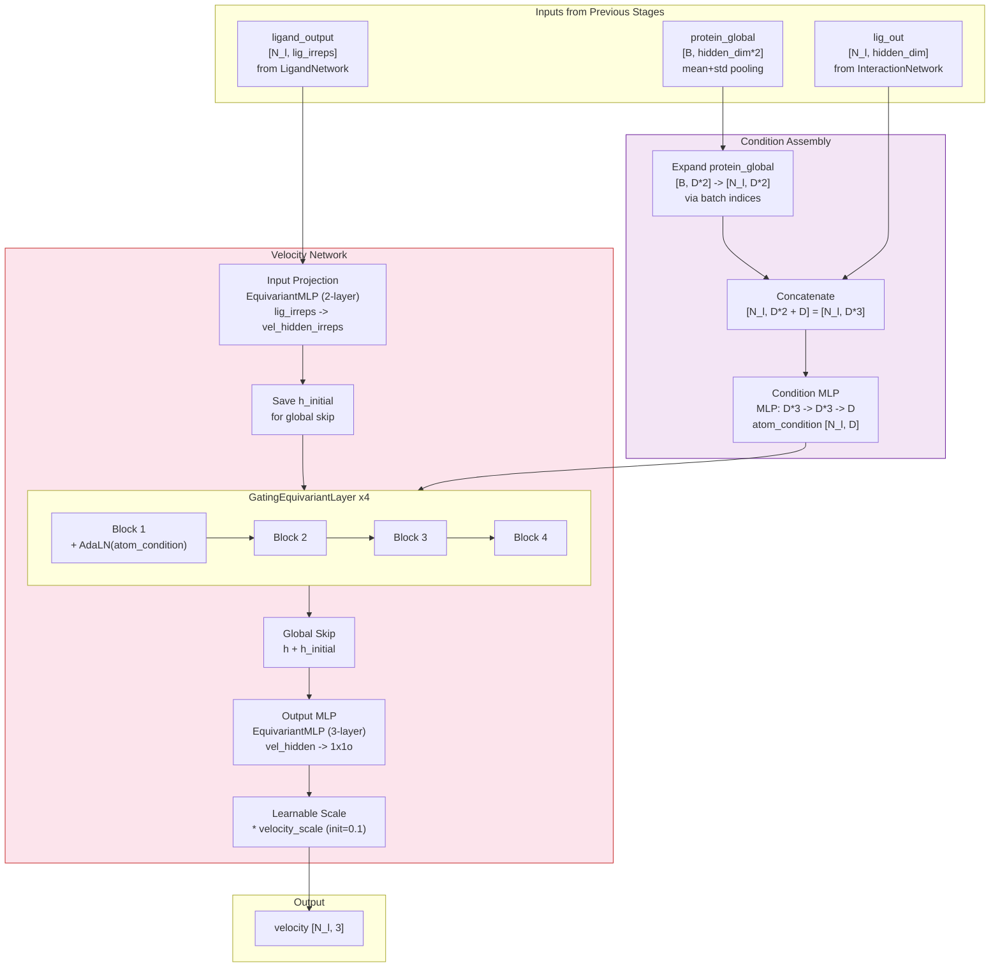
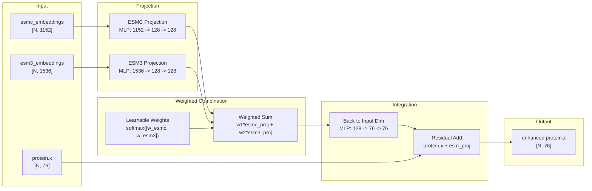
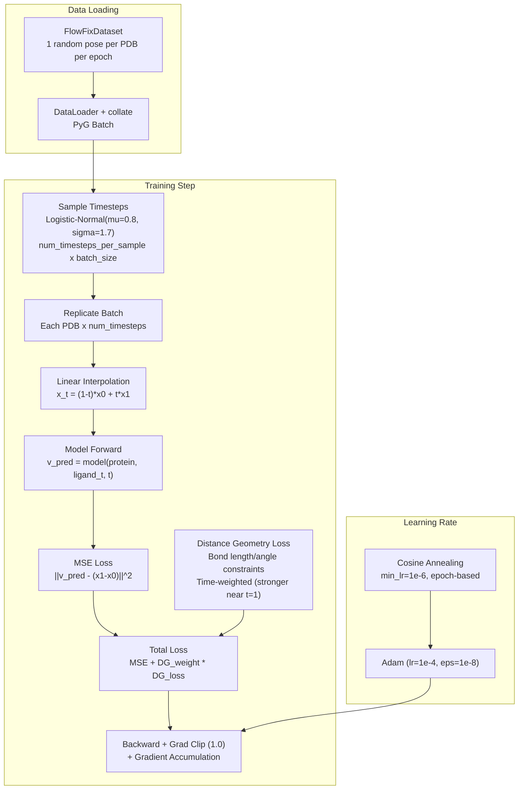
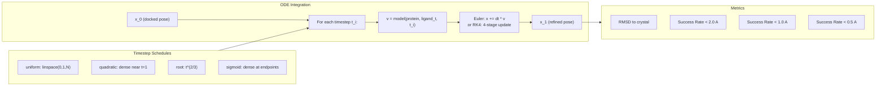
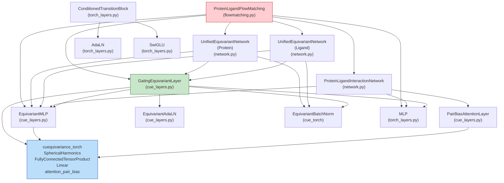

# FlowFix Architecture Documentation

## Overview

FlowFix refines perturbed protein-ligand binding poses back to crystal structures using **SE(3)-equivariant flow matching**. The model learns velocity fields that move ligand atoms from docked poses (t=0) to crystal structures (t=1) via linear interpolation.

---

## High-Level Architecture



---

## Detailed Module Diagrams

### 1. UnifiedEquivariantNetwork (Encoder)

Shared architecture for both protein and ligand encoding. Uses cuEquivariance for SE(3)-equivariant operations.



**Protein config**: `76x0e + 31x1o` input, `128x0e + 32x1o + 32x1e` output, 3 layers
**Ligand config**: `121x0e` input (scalar only), `128x0e + 16x1o + 16x1e` output, 3 layers

---

### 2. GatingEquivariantLayer (Core Building Block)

The fundamental SE(3)-equivariant message passing layer used throughout the model.



---

### 3. ProteinLigandInteractionNetwork

Cross-attention between protein and ligand using NVIDIA's cuEquivariance `attention_pair_bias`.



---

### 4. Velocity Prediction Pipeline

How the final velocity vectors are computed from encoded features.



---

### 5. ESM Embedding Integration

How pre-trained protein language model embeddings are integrated.



---

## Training Pipeline

### Flow Matching Training



### Validation (ODE Sampling)



---

## Tensor Dimensions Reference

### Feature Dimensions (Default Config)

| Component | Irreps / Dimension | Description |
|-----------|-------------------|-------------|
| Protein input (scalar) | 76 | Residue-level features |
| Protein input (vector) | 31 x 3 = 93 | Geometric vector features |
| Protein edge (scalar) | 39 | Edge scalar features |
| Protein edge (vector) | 8 x 3 = 24 | Edge vector features |
| Protein hidden | `128x0e + 32x1o + 32x1e` | Hidden representation |
| Protein output | `128x0e + 32x1o + 32x1e` | Encoded representation |
| Ligand input (scalar) | 121 | Atom-level features |
| Ligand edge (scalar) | 44 | Bond features |
| Ligand hidden | `128x0e + 16x1o + 16x1e` | Hidden representation |
| Ligand output | `128x0e + 16x1o + 16x1e` | Encoded representation |
| Interaction hidden_dim | 256 | Unified scalar dimension |
| Pair bias dim | 64 | Pairwise feature dimension |
| Attention heads | 8 | Multi-head attention |
| Velocity hidden | `128x0e + 16x1o + 16x1e` | Velocity network hidden |
| Velocity output | `1x1o` = 3 | Per-atom velocity vector |
| ESM-C embedding | 1152 | ESM-C 600M output |
| ESM-3 embedding | 1536 | ESM-3 output |

### Irreps Notation

| Symbol | Meaning |
|--------|---------|
| `Nx0e` | N scalar channels (even parity, l=0) |
| `Nx1o` | N vector channels (odd parity, l=1) - true vectors |
| `Nx1e` | N pseudo-vector channels (even parity, l=1) |
| `1x1o` | Single 3D vector - used for velocity output |

---

## Module Dependency Graph



---

## File Structure

```
src/models/
  flowmatching.py          # ProteinLigandFlowMatching (top-level model)
  network.py               # UnifiedEquivariantNetwork, ProteinLigandInteractionNetwork
  cue_layers.py            # cuEquivariance layers (GatingEquivariantLayer, EquivariantMLP, etc.)
  torch_layers.py          # Pure PyTorch layers (MLP, AdaLN, SwiGLU, etc.)

src/utils/
  losses.py                # Distance geometry loss, clash loss
  sampling.py              # ODE integration (Euler, RK4), timestep schedules
  training_utils.py        # Optimizer, scheduler, timestep sampling
  model_builder.py         # Model construction from config
  data_utils.py            # Dataset/dataloader creation
  early_stop.py            # Early stopping with best model restoration

src/data/
  dataset.py               # FlowFixDataset (lazy/hybrid/preload modes)
  protein_feat.py          # Protein featurization + ESM embeddings
  ligand_feat.py           # Ligand featurization

train.py                   # FlowFixTrainer (main training loop)
inference.py               # Inference script
```

---

## Key Design Decisions

1. **Separate encoders + cross-attention** (not joint graph): Protein and ligand have different feature types (vectors vs scalar-only), processed separately then interact via attention.

2. **Time is implicit**: No explicit time embedding. Time information is encoded in `x_t` coordinates (linear interpolation position). The velocity field `v = x1 - x0` is time-independent for linear paths.

3. **cuEquivariance for SE(3)**: Uses NVIDIA's cuEquivariance library for hardware-accelerated equivariant operations (tensor products, spherical harmonics, attention).

4. **Zero-initialized velocity output**: Final velocity projection is zero-initialized with learnable scale (init=0.1) for stable early training.

5. **Dual conditioning in velocity blocks**: Each GatingEquivariantLayer receives atom-level conditioning via EquivariantAdaLN at both input (before message passing) and output (after batch norm).

6. **Multiple timesteps per sample**: Each PDB system is evaluated at `num_timesteps_per_sample` different timesteps per training step for efficiency.
