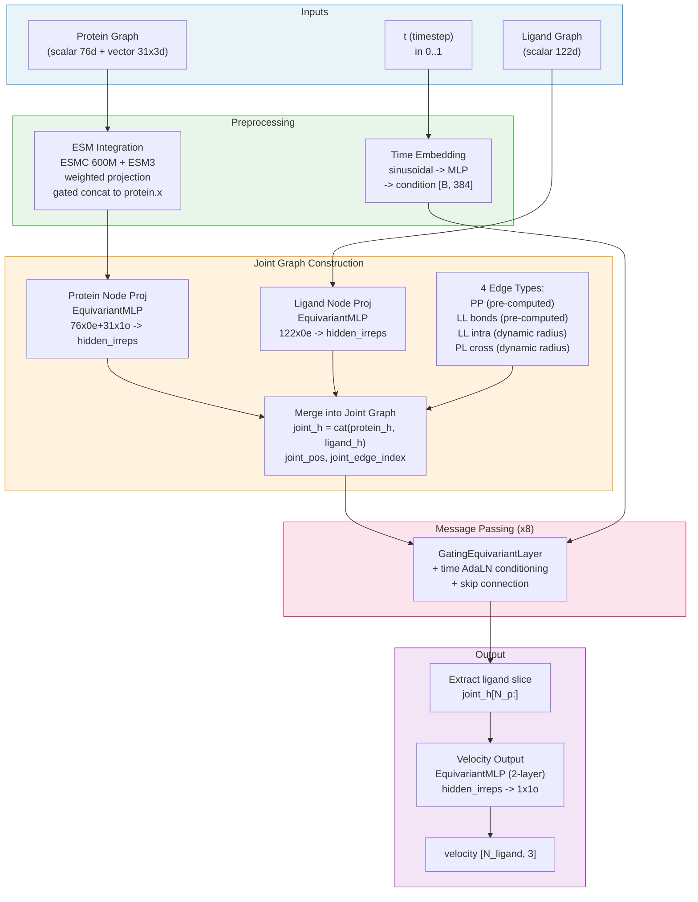
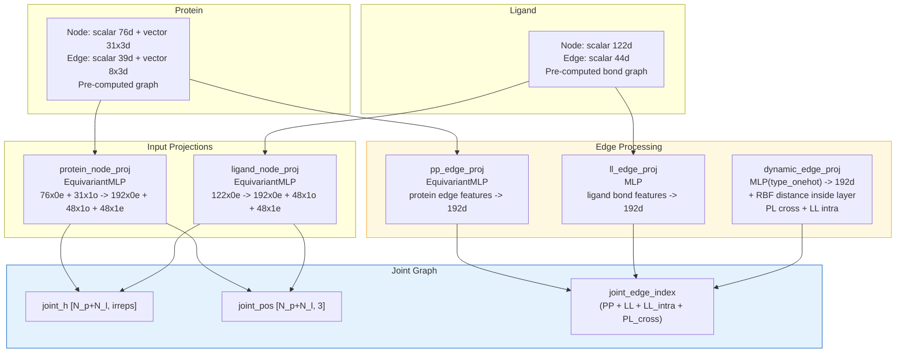
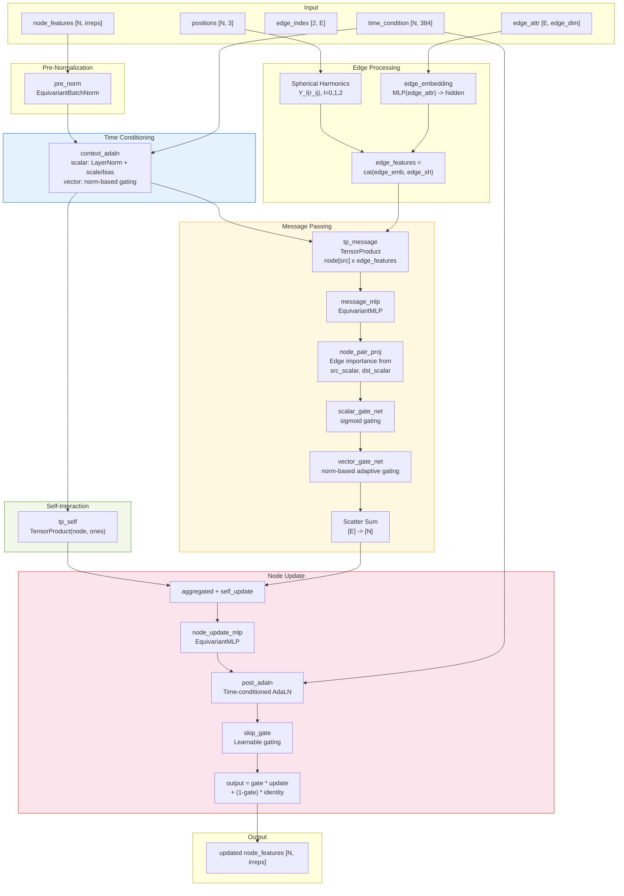
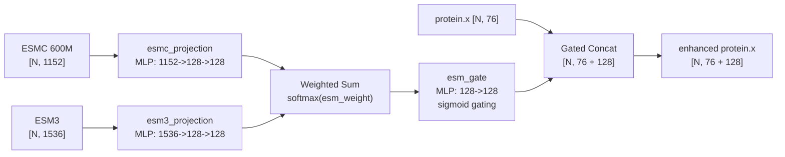
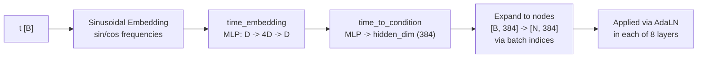
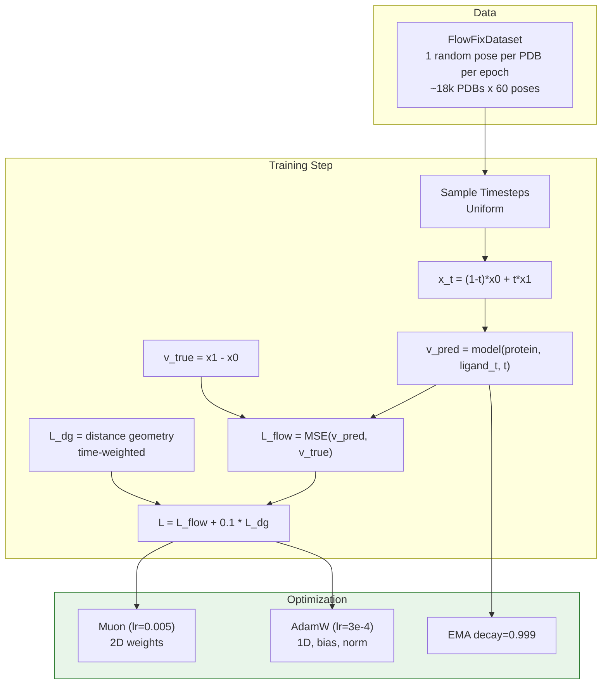
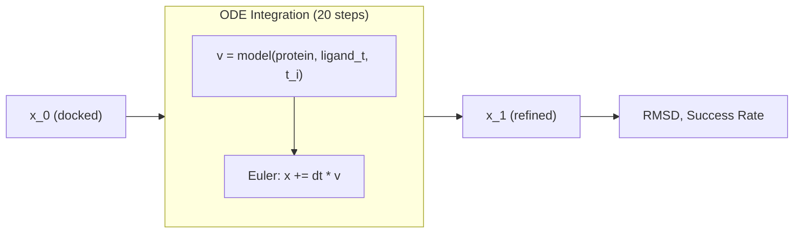

# FlowFix Architecture Documentation

## Overview

FlowFix refines perturbed protein-ligand binding poses back to crystal structures using **SE(3)-equivariant flow matching**. The model learns velocity fields that move ligand atoms from docked poses (t=0) to crystal structures (t=1) via linear interpolation.

**Trained model**: `rectified-flow-full-v4` (joint graph, 8-layer, ~13M params)

---

## High-Level Architecture



---

## Detailed Module Diagrams

### 1. Joint Graph Construction

Protein과 ligand를 하나의 그래프로 합쳐서 direct message passing.



**Dynamic edge construction** (every forward):
- `PL cross`: protein-ligand radius graph (cutoff=6.0A, max_neighbors=16)
- `LL intra`: ligand intra-molecular radius graph (cutoff=6.0A, supplements bond edges)

---

### 2. GatingEquivariantLayer (Core Block)

Joint graph 위에서 8번 반복되는 SE(3)-equivariant message passing layer.



---

### 3. ESM Embedding Integration



---

### 4. Time Conditioning



---

## Training Pipeline

### Flow Matching



### ODE Sampling (Inference)



---

## Dimension Reference (v4)

| Component | Value | Description |
|-----------|-------|-------------|
| Protein node scalar | 76 | Residue features |
| Protein node vector | 31 x 3 | Geometric vectors |
| Protein edge scalar | 39 | Edge features |
| Protein edge vector | 8 x 3 | Edge vectors |
| Ligand node scalar | 122 | Atom features |
| Ligand edge scalar | 44 | Bond features |
| Hidden scalar | 192 | Joint hidden |
| Hidden vector | 48 | Joint hidden |
| Hidden edge | 192 | Edge embedding |
| Hidden irreps | `192x0e + 48x1o + 48x1e` | 480d total |
| Time condition | 384 | AdaLN conditioning |
| ESM projection | 128 | ESM feature dim |
| Cross-edge cutoff | 6.0 A | PL dynamic edges |
| RBF features | 32 | Distance encoding |
| Max neighbors | 16 | KNN cap |
| Joint layers | 8 | Message passing depth |
| Velocity output | 1x1o = 3 | Per-atom velocity |

---

## Module Structure (from checkpoint)

```
Top-level:
  esm_weight                    # Learnable [ESMC, ESM3] weights
  esmc_projection               # MLP: 1152 -> 128
  esm3_projection               # MLP: 1536 -> 128
  esm_gate                      # MLP: 128 -> 128 (sigmoid)
  time_embedding                # Sinusoidal + MLP
  time_to_condition             # MLP -> 384d

  joint_network/
    protein_node_proj           # EquivariantMLP
    ligand_node_proj            # EquivariantMLP
    pp_edge_proj                # EquivariantMLP (protein edges)
    ll_edge_proj                # MLP (ligand bond edges)
    dynamic_edge_proj           # MLP (PL cross + LL intra)

    layers[0..7]/               # 8x GatingEquivariantLayer
      pre_norm                  #   EquivariantBatchNorm
      context_adaln             #   Time AdaLN (input)
      edge_embedding            #   MLP(edge_attr)
      tp_message                #   TensorProduct (message)
      message_mlp               #   EquivariantMLP
      node_pair_proj            #   Edge importance
      scalar_gate_net           #   Scalar gating
      vector_norm_net           #   Vector norm features
      vector_gate_net           #   Vector gating
      tp_self                   #   TensorProduct (self)
      node_update_mlp           #   EquivariantMLP
      post_adaln                #   Time AdaLN (output)
      skip_gate                 #   Learnable skip
      rbf_centers, rbf_width    #   RBF params

    velocity_output             # EquivariantMLP -> 1x1o
```

**716 parameter tensors, ~13M trainable parameters**

---

## Training Config (v4)

| Parameter | Value |
|-----------|-------|
| Architecture | Joint graph |
| Joint layers | 8 |
| Hidden (scalar/vector) | 192 / 48 |
| Edge cutoff | 6.0 A |
| Optimizer | Muon (lr=0.005) + AdamW (lr=3e-4) |
| Schedule | Warmup 5% + Plateau 80% + Cosine 15% |
| Loss | Velocity MSE + DG (0.1) |
| EMA | decay=0.999 |
| Batch size | 32 |
| Epochs | 500 |
| Dropout | 0.1 |

---

## Key Design Decisions

1. **Joint graph** (not separate encoders + attention): Protein-ligand interaction via direct message passing on unified graph. Cross-edges propagate protein context to ligand nodes.

2. **4 edge types**: Pre-computed (PP, LL bonds) + dynamic (PL cross, LL intra). Dynamic edges recomputed every forward via `radius_graph`.

3. **Explicit time conditioning**: Sinusoidal -> MLP -> AdaLN at input and output of each layer.

4. **Muon + AdamW hybrid**: Muon for 2D weight matrices, AdamW for 1D params/bias/norm.

5. **EMA**: decay=0.999, used for inference.

6. **Gated skip connections**: Learnable gate balances new features vs identity, stabilizes deep (8-layer) network.
