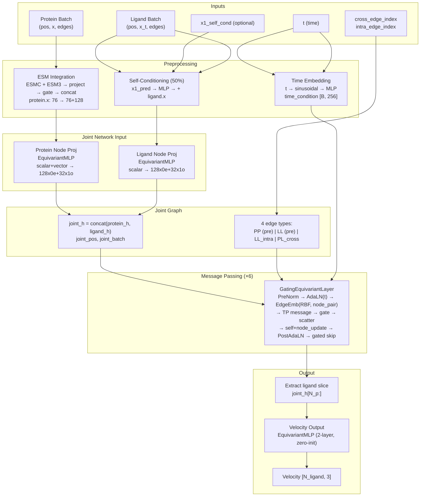

# FlowFix Architecture Diagram

## Visual Diagram

## Mermaid Flowchart (editable)

## Data Flow Summary

| Stage | Input | Output |
|-------|--------|--------|
| ESM | protein.x [N,76], esmc [N,1152], esm3 [N,1536] | protein.x [N, 76+128] |
| Self-cond | ligand.x, x1_pred [N_l,3] | ligand.x + gate(x1_pred) |
| Time | t [B] | time_condition [B, 256] |
| Node proj | protein/ligand features | joint_h [N_p+N_l, hidden_irreps] |
| Edges | pos, batch, pre-computed edges | joint_edge_index, joint_edge_attr (4 types) |
| 6× Layer | joint_h, pos, edges, time_condition | updated joint_h |
| Velocity head | ligand_h | velocity [N_l, 3] |

## Edge Types

| Type | Source | Features |
|------|--------|----------|
| PP | Protein–protein (pre-computed) | EquivariantMLP(edge_attr + edge_vector) |
| LL | Ligand–ligand bonds (pre-computed) | EquivariantMLP(edge_attr) |
| LL_intra | Ligand radius_graph (dynamic) | MLP(type_onehot), RBF inside layer |
| PL_cross | Protein–ligand radius (dynamic) | MLP(type_onehot), RBF inside layer |
