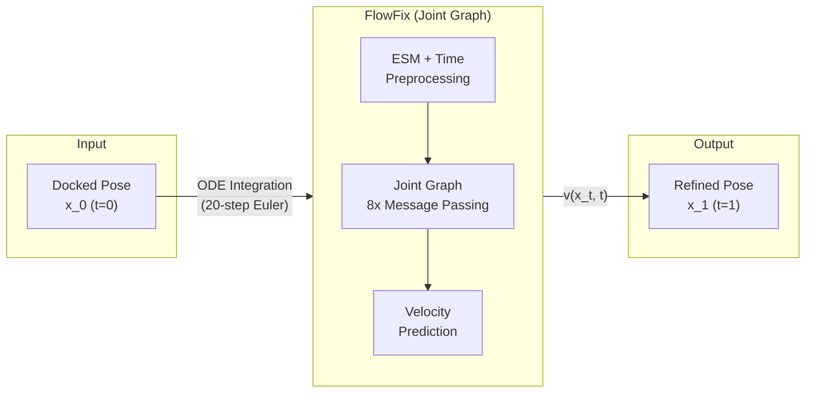
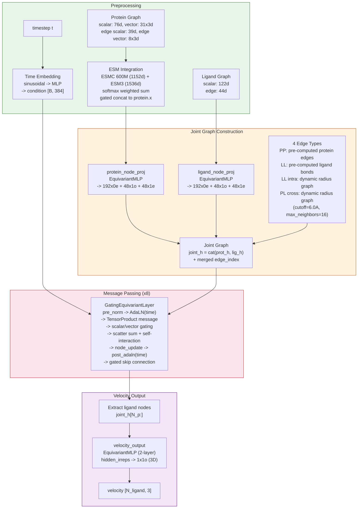
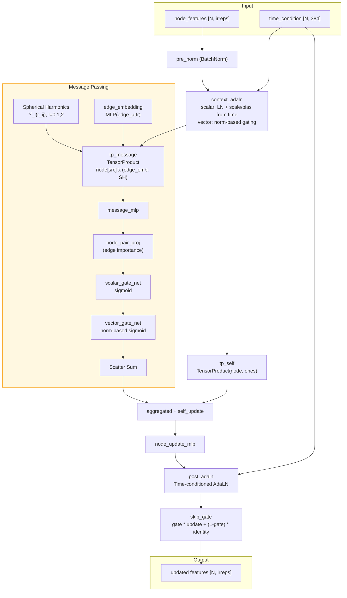
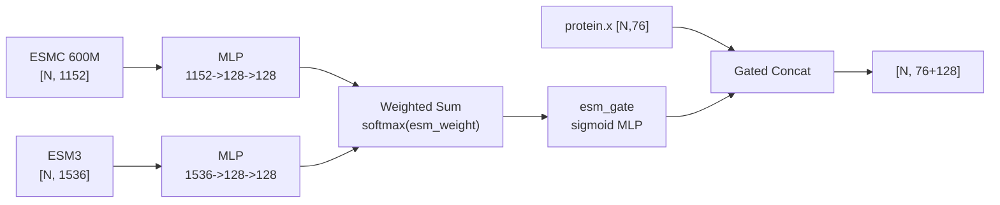
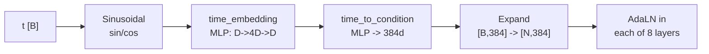
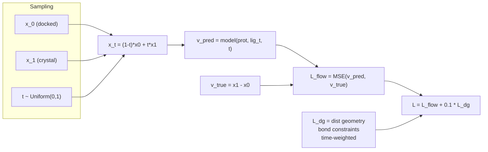
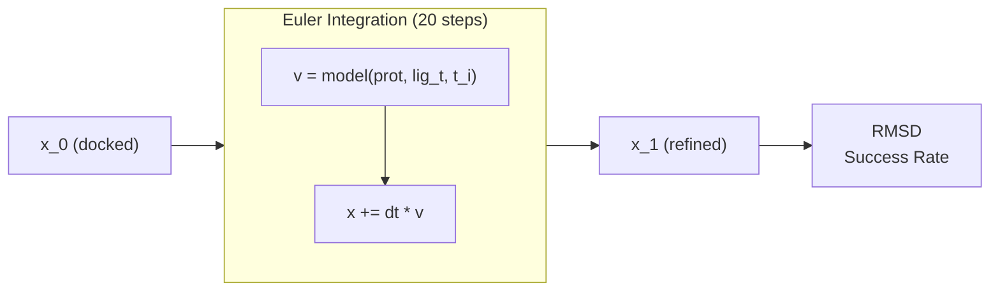

# FlowFix Model Architecture

> **SE(3)-Equivariant Flow Matching for Protein-Ligand Pose Refinement**
>
> Last updated: 2026-03-06
>
> Trained model: `rectified-flow-full-v4` (joint graph, 8-layer, ~13M params)

---

## 1. Overview

FlowFix는 docking pose를 crystal structure로 refinement하는 SE(3)-equivariant flow matching 모델입니다.
Linear interpolation path `x_t = (1-t)*x0 + t*x1`을 따라 per-atom velocity field `v(x_t, t)`를 학습합니다.

### Pipeline Summary



### Key Design Choices

| Component | Choice | Rationale |
|-----------|--------|-----------|
| Graph structure | Joint protein-ligand graph | Cross-edge로 protein context 직접 전달 |
| Equivariance | cuEquivariance tensor product | SE(3) symmetry 보존, GPU-accelerated |
| Interaction | Direct message passing (no attention) | 단순하고 효율적인 protein-ligand interaction |
| Time conditioning | Explicit sinusoidal + AdaLN | 각 layer에서 time-aware feature modulation |
| Optimizer | Muon + AdamW hybrid | 2D weight matrix에 Muon, 나머지 AdamW |
| Generative model | Flow matching (rectified flow) | Stable training, fast sampling |
| Protein embedding | ESMC 600M + ESM3 (weighted) | Pre-trained sequence representation |

---

## 2. Model Architecture

### 2.1 Full Pipeline



---

### 2.2 GatingEquivariantLayer (Core Block)

8번 반복되는 SE(3)-equivariant message passing layer. Joint graph의 모든 node (protein + ligand) 위에서 동작.



**핵심 특징:**
- **Tensor Product**: `cuequivariance_torch.FullyConnectedTensorProduct`로 SE(3) equivariance 보존
- **Dual Gating**: Scalar gate (element-wise sigmoid) + Vector gate (norm-based adaptive sigmoid)
- **Edge Importance**: src/dst scalar features로 학습 가능한 message weight
- **Dual AdaLN**: Input/Output 양쪽에서 time conditioning
- **Gated Skip**: 학습 가능한 gate로 identity와 update 비율 결정

---

### 2.3 ESM Embedding Integration

Pre-trained PLM의 residue-level embedding을 protein features에 통합.



- ESM weight: learnable `nn.Parameter`, softmax 정규화
- Gated concatenation: sigmoid gate로 ESM feature 영향도 학습

---

### 2.4 Time Conditioning



---

## 3. Training

### 3.1 Flow Matching Loss



### 3.2 Training Configuration

| Parameter | Value |
|-----------|-------|
| Architecture | Joint graph (8 layers) |
| Hidden (scalar/vector) | 192 / 48 |
| Hidden irreps | `192x0e + 48x1o + 48x1e` (480d) |
| Edge cutoff | 6.0 A, max 16 neighbors |
| Optimizer | Muon (lr=0.005) + AdamW (lr=3e-4) |
| Schedule | Warmup 5% + Plateau 80% + Cosine 15% |
| Loss | Velocity MSE + DG loss (weight=0.1) |
| EMA | decay=0.999 (inference에 사용) |
| Batch size | 32 |
| Epochs | 500 |
| Dropout | 0.1 |
| ODE sampling | 20-step Euler, uniform schedule |

### 3.3 ODE Sampling (Inference)



---

## 4. Dimension Reference

```
Protein:
  Node scalar:  76   ─┐
  Node vector:  31x3  │  + ESM 128d (gated concat)
  Edge scalar:  39    ├─> protein_node_proj ──> 192x0e + 48x1o + 48x1e
  Edge vector:  8x3   ┘

Ligand:
  Node scalar:  122 ─┐
  Edge scalar:  44   ├─> ligand_node_proj ──> 192x0e + 48x1o + 48x1e
                     ┘

Joint Graph:
  Nodes:  N_p + N_l, each 480d (hidden_irreps)
  Edges:  PP + LL + LL_intra + PL_cross, each 192d
  Time:   384d condition via AdaLN

Output:
  Velocity: 1x1o = 3d per ligand atom
```

### Irreps Quick Reference

| Symbol | Meaning | Flat dim |
|--------|---------|----------|
| `192x0e` | 192 scalars (even parity) | 192 |
| `48x1o` | 48 true vectors (odd parity) | 144 |
| `48x1e` | 48 pseudo-vectors (even parity) | 144 |
| Total hidden | `192x0e + 48x1o + 48x1e` | 480 |

---

## 5. Module Structure (from checkpoint)

```
Top-level:
  esm_weight                    # [2] learnable ESMC/ESM3 weights
  esmc_projection               # MLP: 1152 -> 128
  esm3_projection               # MLP: 1536 -> 128
  esm_gate                      # MLP: 128 -> 128 (sigmoid)
  time_embedding                # Sinusoidal + MLP
  time_to_condition             # MLP -> 384d

  joint_network/
    protein_node_proj           # EquivariantMLP
    ligand_node_proj            # EquivariantMLP
    pp_edge_proj                # EquivariantMLP (protein edges)
    ll_edge_proj                # MLP (ligand bond edges)
    dynamic_edge_proj           # MLP (PL cross + LL intra)

    layers[0..7]/               # 8x GatingEquivariantLayer
      pre_norm                  #   EquivariantBatchNorm
      context_adaln             #   Time AdaLN (input)
      edge_embedding            #   MLP
      tp_message                #   TensorProduct (message)
      message_mlp               #   EquivariantMLP
      node_pair_proj            #   Edge importance
      scalar_gate_net           #   Scalar gating
      vector_norm_net           #   Vector norm features
      vector_gate_net           #   Vector gating
      tp_self                   #   TensorProduct (self)
      node_update_mlp           #   EquivariantMLP
      post_adaln                #   Time AdaLN (output)
      skip_gate                 #   Learnable skip
      rbf_centers, rbf_width    #   RBF params

    velocity_output             # EquivariantMLP -> 1x1o
```

**716 parameter tensors, ~13M trainable parameters**

---

## 6. File Map

```
src/models/
  flowmatching.py    Model definitions
  network.py         Network components
  cue_layers.py      GatingEquivariantLayer, EquivariantMLP, ...
  torch_layers.py    MLP, AdaLN, SwiGLU, TimeEmbedding, ...

src/data/
  dataset.py         FlowFixDataset

src/utils/
  losses.py          Distance geometry loss, clash loss
  sampling.py        ODE integration, timestep schedules
  model_builder.py   Config -> model construction

configs/
  train_rectified_flow_full.yaml   # v4 config (trained model)
  train_joint.yaml                 # Joint architecture template

train.py             Training loop
inference.py         Inference script
```
