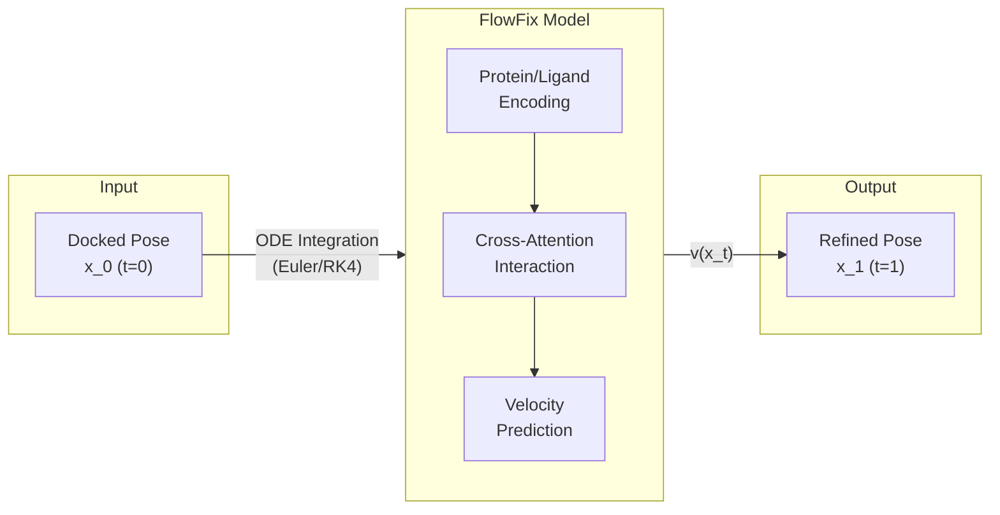
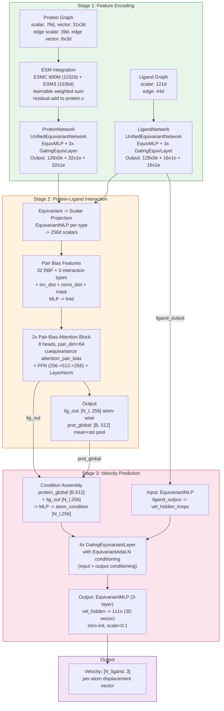
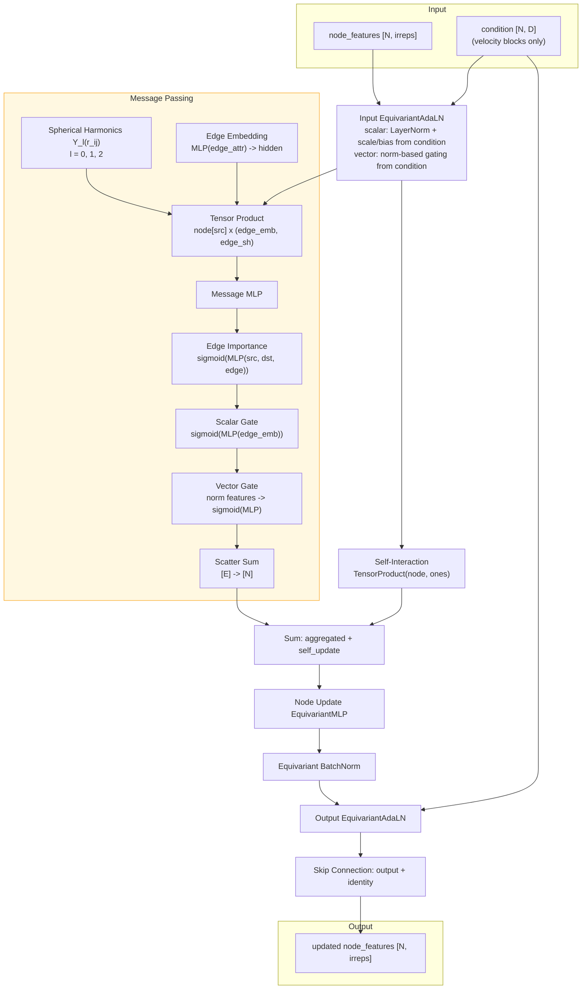
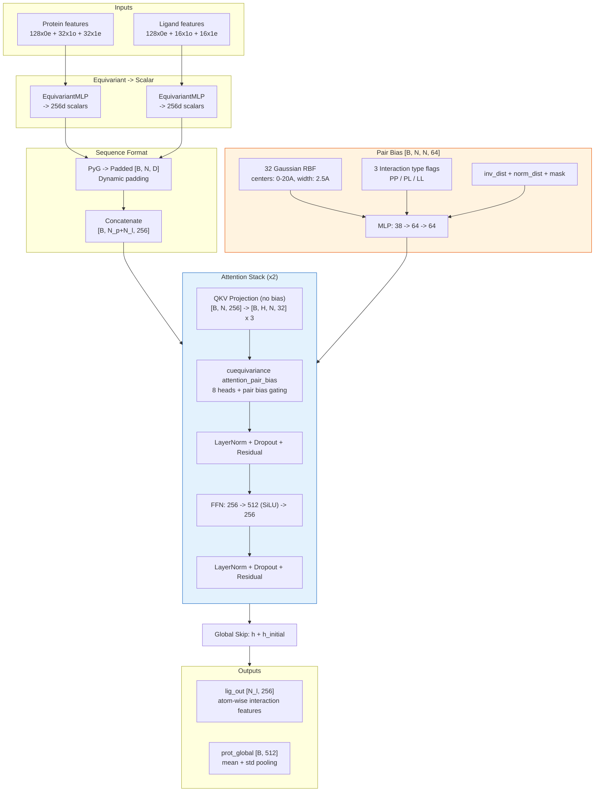
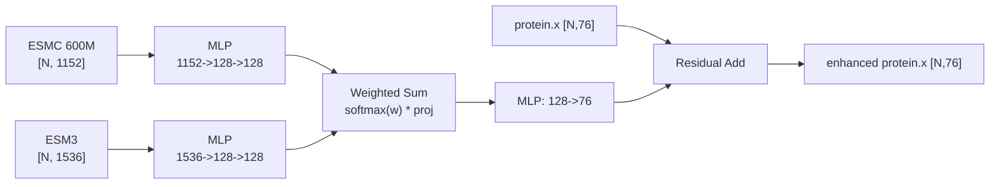
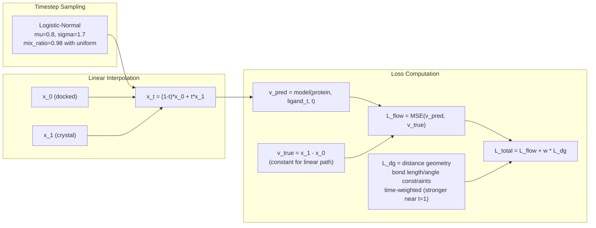
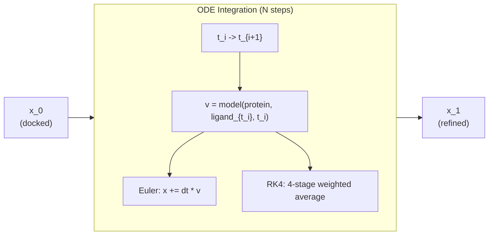
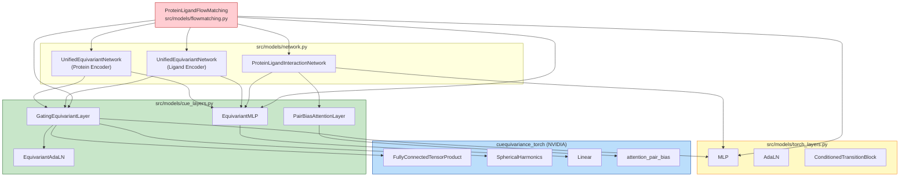

# FlowFix Model Architecture

> **SE(3)-Equivariant Flow Matching for Protein-Ligand Pose Refinement**
>
> Last updated: 2025-03-06

---

## 1. Overview

FlowFix는 docking pose를 crystal structure로 refinement하는 SE(3)-equivariant flow matching 모델입니다.
Linear interpolation path `x_t = (1-t)*x0 + t*x1`을 따라 per-atom velocity field `v(x_t)`를 학습합니다.

### Pipeline Summary



### Key Design Choices

| Component | Previous (v4) | Current | Rationale |
|-----------|--------------|---------|-----------|
| Graph structure | Joint protein-ligand graph | Separate encoders + cross-attention | Protein/ligand feature type이 다름 (vector vs scalar) |
| Interaction | Message passing on joint graph | Pair-bias attention (cuEquivariance) | 더 expressive한 long-range interaction |
| Time conditioning | Explicit sinusoidal embedding | Implicit (x_t coordinates) | Linear path에서 v = x1 - x0는 time-independent |
| Optimizer | Muon + AdamW hybrid | Adam | 단순화 |
| Velocity output | Single equivariant MLP | 4-layer conditioned GatingEquivariantLayer | Richer conditioning with protein context |

---

## 2. Model Architecture

### 2.1 Full Pipeline



---

### 2.2 GatingEquivariantLayer (Core Block)

모든 equivariant processing의 기본 단위. Protein encoder, ligand encoder, velocity predictor 모두에서 사용.



**핵심 특징:**
- **Tensor Product**: `cuequivariance_torch.FullyConnectedTensorProduct`로 SE(3) equivariance 보존
- **Dual Gating**: Scalar gate (element-wise) + Vector gate (norm-based adaptive)
- **Edge Importance**: 학습 가능한 message-level attention weight
- **Dual AdaLN**: Input/Output 양쪽에서 context conditioning (velocity blocks에서만)

---

### 2.3 Cross-Attention Interaction

Protein-ligand 간 상호작용을 pair-bias attention으로 모델링.



---

### 2.4 ESM Embedding Integration

Pre-trained protein language model (PLM)의 residue-level embedding을 protein features에 통합.



- ESMC와 ESM3의 가중치는 학습 가능한 파라미터 (`nn.Parameter`)
- Softmax로 정규화 후 weighted sum
- 원래 protein feature에 residual connection으로 추가

---

## 3. Training

### 3.1 Flow Matching Loss



**Multi-timestep training**: 각 PDB system에 대해 `num_timesteps_per_sample`개의 서로 다른 timestep에서 loss 계산.
이를 위해 batch를 replicate하여 효율적으로 처리.

### 3.2 Training Configuration

| Parameter | Value |
|-----------|-------|
| Optimizer | Adam (lr=1e-4, eps=1e-8) |
| Scheduler | Cosine Annealing (min_lr=1e-6, epoch-based) |
| Gradient clipping | 1.0 |
| Batch size | config-dependent |
| Gradient accumulation | configurable |
| Distance geometry weight | 0.1 |
| Dropout | 0.1 |
| Early stopping | patience=50 on success rate <2A |

### 3.3 ODE Sampling (Inference/Validation)



**Timestep schedules:**
- `uniform`: 등간격
- `quadratic`: t=1 근처에서 dense (1-(1-t)^1.5)
- `root`: t^(2/3)
- `sigmoid`: 양 끝점 근처에서 dense

---

## 4. Dimension Reference

### Feature Dimensions

```
Protein:
  Node scalar:  76  ─┐
  Node vector:  31x3 ├─> UnifiedEquivNet ──> 128x0e + 32x1o + 32x1e (320d)
  Edge scalar:  39   │
  Edge vector:  8x3  ┘

Ligand:
  Node scalar:  121 ─┐
  Edge scalar:  44   ├─> UnifiedEquivNet ──> 128x0e + 16x1o + 16x1e (224d)
                     ┘

Interaction:
  Input:   320d (protein) + 224d (ligand)
  Hidden:  256d (scalar only, after equivariant projection)
  Pair:    64d (RBF + type features)
  Output:  256d per atom (ligand), 512d global (protein mean+std)

Velocity:
  Input:   224d (ligand irreps)
  Hidden:  128x0e + 16x1o + 16x1e (224d)
  Condition: 256d (protein_global 512 + lig_out 256 -> MLP -> 256)
  Output:  1x1o = 3d (velocity vector per atom)
```

### Irreps Notation Quick Reference

| Symbol | Meaning | Dimension |
|--------|---------|-----------|
| `Nx0e` | N scalar channels (even parity) | N |
| `Nx1o` | N true vector channels (odd parity) | N x 3 |
| `Nx1e` | N pseudo-vector channels (even parity) | N x 3 |

---

## 5. Module Dependency



---

## 6. Parameter Count Breakdown

| Module | Approx. Parameters | Role |
|--------|-------------------|------|
| ProteinNetwork | ~1.5M | Protein structure encoding |
| LigandNetwork | ~1.0M | Ligand structure encoding |
| ESM Projections | ~0.5M | PLM embedding integration |
| InteractionNetwork | ~2.5M | Cross-attention + pair bias |
| Velocity Blocks (x4) | ~3.0M | Conditioned velocity prediction |
| Velocity I/O MLPs | ~0.5M | Input/output projections |
| **Total** | **~9M** | |

> 정확한 수치는 config에 따라 다름. `train.py` 실행 시 출력됨.

---

## 7. File Map

```
src/models/
  flowmatching.py    ProteinLigandFlowMatching (top-level)
  network.py         UnifiedEquivariantNetwork, ProteinLigandInteractionNetwork
  cue_layers.py      GatingEquivariantLayer, EquivariantMLP, PairBiasAttention, ...
  torch_layers.py    MLP, AdaLN, SwiGLU, TimeEmbedding, ...

src/data/
  dataset.py         FlowFixDataset (lazy/hybrid/preload)
  protein_feat.py    Protein featurization + ESM
  ligand_feat.py     Ligand featurization

src/utils/
  losses.py          Distance geometry loss, clash loss
  sampling.py        ODE integration, timestep schedules
  training_utils.py  Optimizer, scheduler builders
  model_builder.py   Config -> model construction

train.py             Training loop (FlowFixTrainer)
inference.py         Inference script
```
