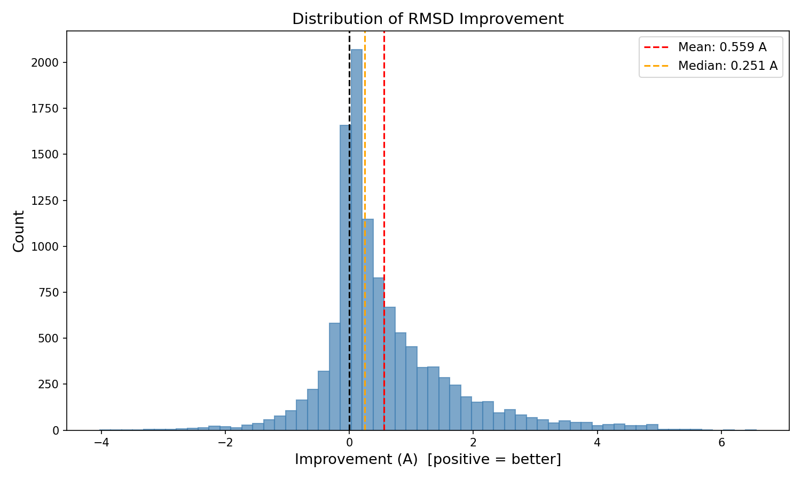
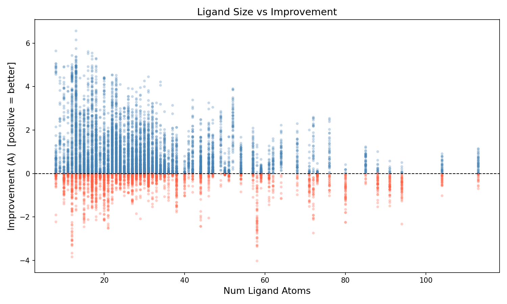
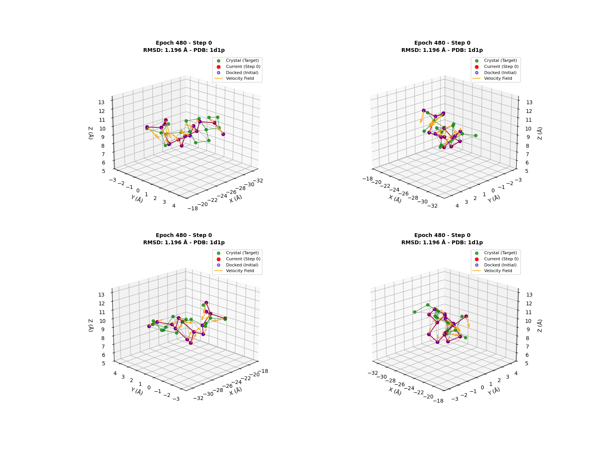

# Cartesian v4 Baseline Results

> **Model**: `rectified-flow-full-v4` (joint graph, 8-layer GatingEquivariantLayer, ~13M params)
>
> **Output**: Per-atom Cartesian velocity [N, 3]
>
> **Evaluation**: 200 PDBs, 11,543 poses, 20-step Euler ODE, EMA applied

---

## Summary Metrics

| Metric | Before Refinement | After Refinement | Change |
|--------|-------------------|------------------|--------|
| Mean RMSD | 3.20 A | 2.64 A | -0.56 A |
| Median RMSD | 3.00 A | 2.22 A | -0.78 A |
| Success rate (<2A) | 30.4% | 44.6% | +14.2%p |
| Success rate (<1A) | 8.7% | 13.5% | +4.8%p |
| Success rate (<0.5A) | 0.7% | 1.3% | +0.6%p |
| Improved poses | - | 75.2% | - |

---

## Visualizations

### RMSD Distribution: Before vs After

Refinement 후 분포가 전체적으로 왼쪽(낮은 RMSD)으로 이동. Mean 3.20A -> 2.64A.

### Per-Pose: Initial vs Final RMSD

대각선 아래 = 개선된 pose. **75.2%의 pose가 개선됨.**

### Per-PDB: Average Initial vs Final RMSD

PDB 단위로 평균하면 **200개 중 178개 (89.0%)가 개선됨.** 대부분의 target에서 일관된 개선.

### RMSD Improvement Distribution

Mean improvement: 0.56A, Median: 0.25A. 양의 방향(개선)으로 skewed.

### Initial RMSD vs Improvement

Initial RMSD가 클수록 improvement 폭도 큼. 단, 매우 큰 perturbation (>8A)에서는 효과 감소.

### Ligand Size vs Improvement

원자 수가 적은 ligand에서 개선 폭이 크고 분산도 큼. 큰 ligand는 상대적으로 안정적이나 개선 폭이 작음.

### Refinement Trajectory Example (PDB: 1d1p)

4개 시점에서의 refinement 결과. Green = crystal, Red = current, Purple circle = initial docked pose.

---

## Training Configuration

| Parameter | Value |
|-----------|-------|
| Architecture | Joint graph (8x GatingEquivariantLayer) |
| Hidden irreps | `192x0e + 48x1o + 48x1e` (480d) |
| Edge cutoff (PL cross) | 6.0 A, max 16 neighbors |
| Optimizer | Muon (lr=0.005) + AdamW (lr=3e-4) |
| Schedule | Linear warmup (5%) + Plateau (80%) + Cosine decay (15%) |
| Loss | Velocity MSE + Distance geometry loss (weight=0.1) |
| EMA | decay=0.999 |
| Batch size | 32 |
| Epochs | 500 |
| Dropout | 0.1 |

## Data

- **Checkpoint**: `save/rectified-flow-full-v4/checkpoints/latest.pt`
- **Config**: `output/cartesian_v4_baseline/train_config.yaml`
- **Inference results**: `output/cartesian_v4_baseline/`
