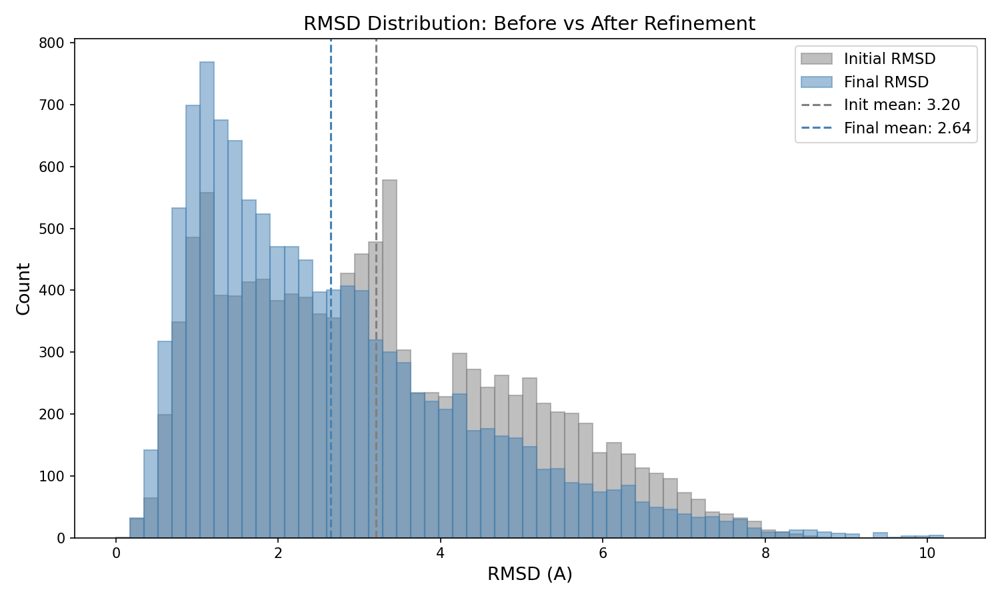
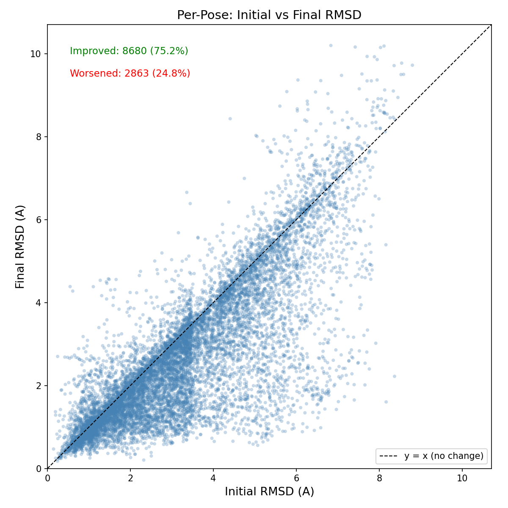
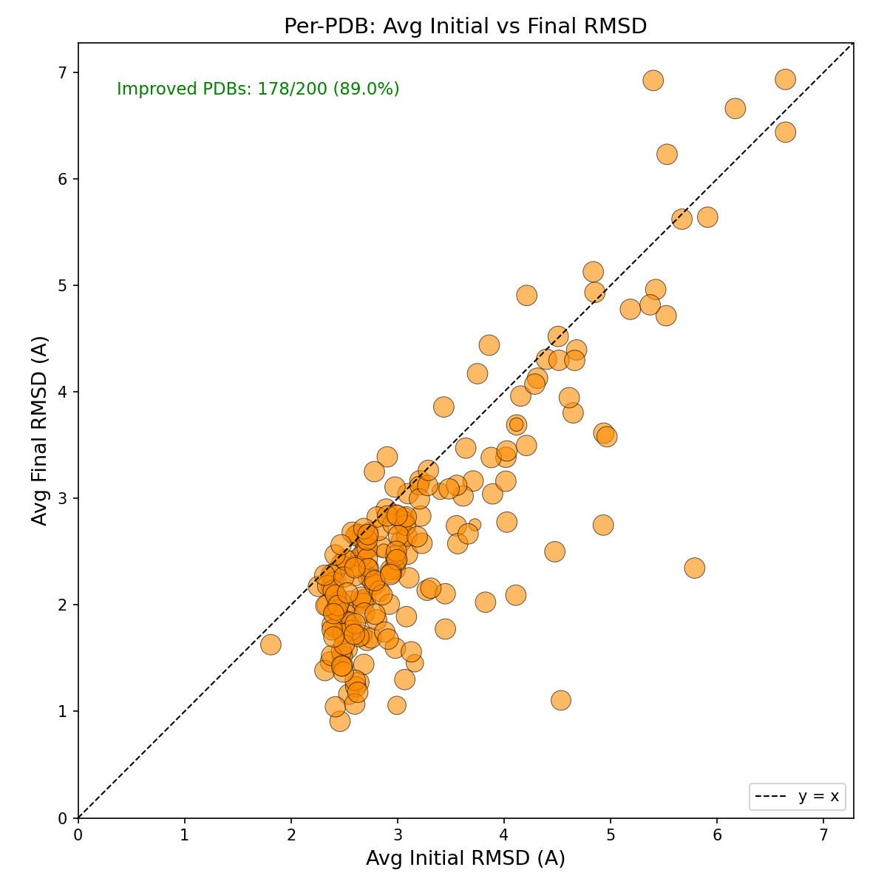
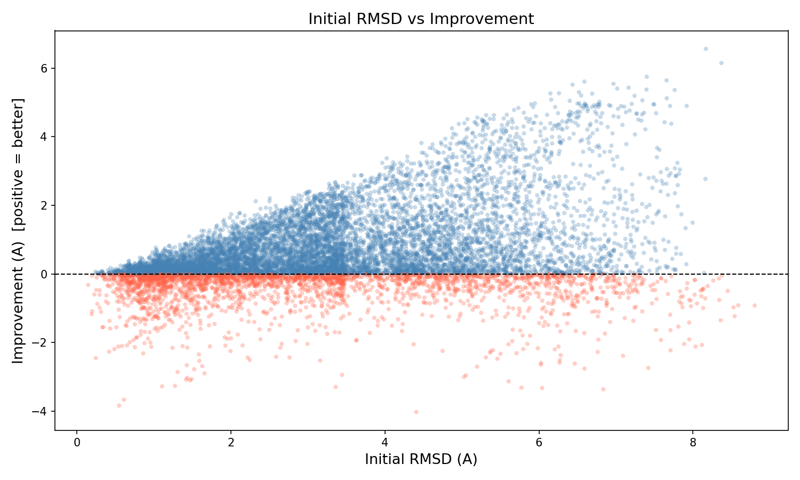
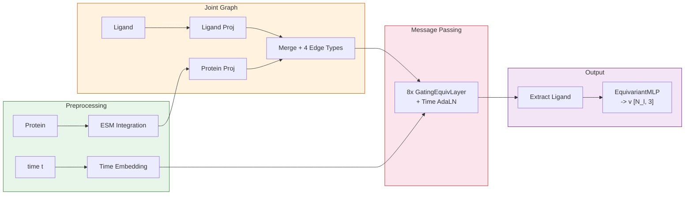

# FlowFix Progress Report

> **SE(3)-Equivariant Flow Matching for Protein-Ligand Pose Refinement**
>
> Last updated: 2026-03-06

---

## Overview

FlowFix는 docking 결과로 얻어진 protein-ligand binding pose를 crystal structure에 가깝게 refinement하는 모델입니다.
SE(3)-equivariant message passing network 위에서 flow matching으로 velocity field를 학습하여, perturbed pose -> crystal pose로의 ODE trajectory를 생성합니다.

### Key Design Choices

| Component | Choice | Rationale |
|-----------|--------|-----------|
| Representation | Joint protein-ligand graph | Cross-edge로 protein context 직접 전달 |
| Equivariance | cuEquivariance tensor product | SE(3) symmetry 보존, GPU-accelerated |
| Interaction | Direct message passing (no attention) | 단순하고 효율적인 protein-ligand interaction |
| Generative model | Flow matching (rectified flow) | Stable training, fast sampling |
| Protein embedding | ESMC 600M + ESM3 (weighted, gated) | Pre-trained sequence representation |
| Optimizer | Muon + AdamW hybrid | 2D weight에 Muon, 나머지 AdamW |

---

## Current Results (v4 - Baseline)

**Model**: `rectified-flow-full-v4` (joint graph, 6-layer GatingEquivariantLayer)
**Evaluation**: 200 PDBs, 11,543 poses, 20-step Euler ODE, EMA applied

### Summary Metrics

| Metric | Before Refinement | After Refinement | Change |
|--------|-------------------|------------------|--------|
| Mean RMSD | 3.20 A | 2.64 A | -0.56 A |
| Median RMSD | 3.00 A | 2.22 A | -0.78 A |
| Success rate (<2A) | 30.4% | 44.6% | +14.2%p |
| Success rate (<1A) | 8.7% | 13.5% | +4.8%p |
| Success rate (<0.5A) | 0.7% | 1.3% | +0.6%p |
| Improved poses | - | 75.2% | - |

### RMSD Distribution: Before vs After

Refinement 후 분포가 전체적으로 왼쪽(낮은 RMSD)으로 이동. Mean 3.20A -> 2.64A.

### Per-Pose: Initial vs Final RMSD

대각선 아래 = 개선된 pose. **75.2%의 pose가 개선됨.**

### Per-PDB: Average Initial vs Final RMSD

PDB 단위로 평균하면 **200개 중 178개 (89.0%)가 개선됨.** 대부분의 target에서 일관된 개선.

### RMSD Improvement Distribution

Mean improvement: 0.56A, Median: 0.25A. 양의 방향(개선)으로 skewed.

### Initial RMSD vs Improvement

Initial RMSD가 클수록 improvement 폭도 큼. 단, 매우 큰 perturbation (>8A)에서는 효과 감소.

### Ligand Size vs Improvement

원자 수가 적은 ligand에서 개선 폭이 크고 분산도 큼. 큰 ligand는 상대적으로 안정적이나 개선 폭이 작음.

### Refinement Trajectory Example (PDB: 1d1p)

4개 시점에서의 refinement 결과. Green = crystal, Red = current, Purple circle = initial docked pose.
Velocity field (orange arrows)를 따라 crystal structure 방향으로 이동.

---

## Architecture

> 상세 아키텍처 문서: [architecture.md](architecture.md)

**Joint graph architecture:**
- Protein + ligand를 하나의 그래프로 합쳐서 **direct message passing** (cross-attention 없음)
- 4 edge types: PP (pre-computed), LL bonds (pre-computed), LL intra (dynamic), PL cross (dynamic, 6.0A cutoff)
- 8x GatingEquivariantLayer with time conditioning via AdaLN
- Velocity output: ligand slice 추출 후 EquivariantMLP -> 3D velocity

### Training Setup

| Parameter | Value |
|-----------|-------|
| Architecture | Joint graph (8x GatingEquivariantLayer) |
| Hidden irreps | `192x0e + 48x1o + 48x1e` (480d) |
| Edge cutoff (PL cross) | 6.0 A, max 16 neighbors |
| Optimizer | Muon (lr=0.005) + AdamW (lr=3e-4) |
| Schedule | Linear warmup (5%) + Plateau (80%) + Cosine decay (15%) |
| Loss | Velocity MSE + Distance geometry loss (weight=0.1) |
| EMA | decay=0.999 |
| Batch size | 32 |
| Epochs | 500 |
| Dropout | 0.1 |

---

## TODO / Next Steps

- [ ] Success rate <2A 목표: 60%+ (현재 44.6%)
- [ ] Self-conditioning 효과 ablation
- [ ] Torsion space decomposition 적용 (utilities exist in ligand_feat.py, not yet integrated)
- [ ] Multi-step refinement (iterative application)
- [ ] Larger dataset / cross-dataset generalization
- [ ] Inference speed optimization (fewer ODE steps)

---

## Changelog

### 2026-02-18 - v4 Baseline Results
- Full validation on 200 PDBs (11,543 poses)
- 20-step Euler ODE with EMA model
- Mean RMSD: 3.20A -> 2.64A, Success rate <2A: 30.4% -> 44.6%

### 2026-02 - Joint Graph Architecture (v4, current)
- Joint protein-ligand graph with 4 edge types (PP, LL, LL intra, PL cross)
- 8x GatingEquivariantLayer with time AdaLN conditioning
- cuEquivariance tensor product for SE(3) equivariance
- Muon + AdamW hybrid optimizer
- EMA (decay=0.999) for inference

### 2024-11 - SE(3) + Torsion Decomposition (not used in training)
- Translation [3D] + Rotation [3D] + Torsion [M] decomposition utilities implemented
- Not integrated into model/training - current model uses Cartesian velocity
- Chain-wise ESM embedding support added
