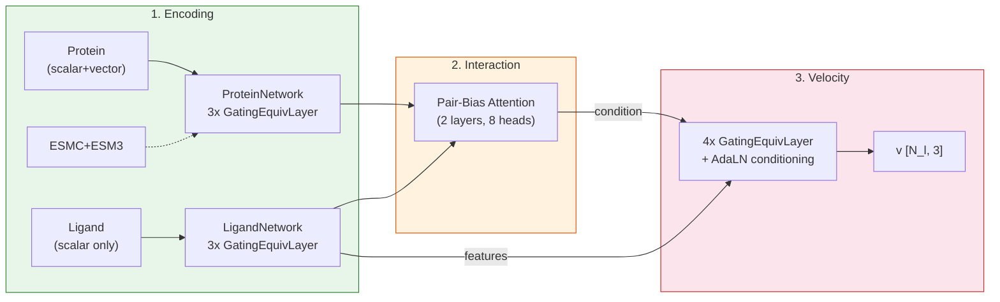

# FlowFix Progress Report

> **SE(3)-Equivariant Flow Matching for Protein-Ligand Pose Refinement**
>
> Last updated: 2025-02-18

---

## Overview

FlowFix는 docking 결과로 얻어진 protein-ligand binding pose를 crystal structure에 가깝게 refinement하는 모델입니다.
SE(3)-equivariant message passing network 위에서 flow matching으로 velocity field를 학습하여, perturbed pose -> crystal pose로의 ODE trajectory를 생성합니다.

### Key Design Choices

| Component | Choice | Rationale |
|-----------|--------|-----------|
| Representation | Separate encoders + cross-attention | Protein/ligand feature type이 다름 (vector vs scalar) |
| Equivariance | cuEquivariance tensor product | SE(3) symmetry 보존, GPU-accelerated |
| Interaction | Pair-bias attention (cuEquivariance) | Long-range protein-ligand interaction |
| Generative model | Flow matching (rectified flow) | Stable training, fast sampling |
| Protein embedding | ESMC 600M + ESM3 (weighted) | Pre-trained sequence representation |
| Time conditioning | Implicit (in x_t coordinates) | Linear path에서 v = x1 - x0는 time-independent |

---

## Current Results (v4 - Baseline)

**Model**: `rectified-flow-full-v4` (joint graph, 6-layer GatingEquivariantLayer)
**Evaluation**: 200 PDBs, 11,543 poses, 20-step Euler ODE, EMA applied

### Summary Metrics

| Metric | Before Refinement | After Refinement | Change |
|--------|-------------------|------------------|--------|
| Mean RMSD | 3.20 A | 2.64 A | -0.56 A |
| Median RMSD | 3.00 A | 2.22 A | -0.78 A |
| Success rate (<2A) | 30.4% | 44.6% | +14.2%p |
| Success rate (<1A) | 8.7% | 13.5% | +4.8%p |
| Success rate (<0.5A) | 0.7% | 1.3% | +0.6%p |
| Improved poses | - | 75.2% | - |

### RMSD Distribution: Before vs After

Refinement 후 분포가 전체적으로 왼쪽(낮은 RMSD)으로 이동. Mean 3.20A -> 2.64A.

### Per-Pose: Initial vs Final RMSD

대각선 아래 = 개선된 pose. **75.2%의 pose가 개선됨.**

### Per-PDB: Average Initial vs Final RMSD

PDB 단위로 평균하면 **200개 중 178개 (89.0%)가 개선됨.** 대부분의 target에서 일관된 개선.

### RMSD Improvement Distribution

Mean improvement: 0.56A, Median: 0.25A. 양의 방향(개선)으로 skewed.

### Initial RMSD vs Improvement

Initial RMSD가 클수록 improvement 폭도 큼. 단, 매우 큰 perturbation (>8A)에서는 효과 감소.

### Ligand Size vs Improvement

원자 수가 적은 ligand에서 개선 폭이 크고 분산도 큼. 큰 ligand는 상대적으로 안정적이나 개선 폭이 작음.

### Refinement Trajectory Example (PDB: 1d1p)

4개 시점에서의 refinement 결과. Green = crystal, Red = current, Purple circle = initial docked pose.
Velocity field (orange arrows)를 따라 crystal structure 방향으로 이동.

---

## Architecture

> 상세 아키텍처 문서: [architecture.md](architecture.md)

**3-stage pipeline:**
1. **Encoding**: Protein (SE(3)-equivariant, scalar+vector) / Ligand (scalar) 각각 별도 encoder
2. **Interaction**: Equivariant -> scalar projection 후 pair-bias cross-attention
3. **Velocity**: Protein global context + atom-wise interaction features로 conditioning된 equivariant velocity prediction

### Training Setup

| Parameter | Value |
|-----------|-------|
| Protein encoder | 3x GatingEquivariantLayer (128x0e + 32x1o + 32x1e) |
| Ligand encoder | 3x GatingEquivariantLayer (128x0e + 16x1o + 16x1e) |
| Interaction | 2x PairBiasAttention (256d, 8 heads, pair_dim=64) |
| Velocity predictor | 4x GatingEquivariantLayer + EquivariantAdaLN conditioning |
| Optimizer | Adam (lr=1e-4, eps=1e-8) |
| Schedule | Cosine Annealing (min_lr=1e-6, epoch-based) |
| Loss | Velocity MSE + Distance geometry loss (weight=0.1, time-aware) |
| Timestep sampling | Logistic-Normal (mu=0.8, sigma=1.7, 98% mix with uniform) |
| Gradient clipping | 1.0 |
| Dropout | 0.1 |

---

## TODO / Next Steps

- [ ] Success rate <2A 목표: 60%+ (현재 44.6%)
- [ ] Self-conditioning 효과 ablation
- [ ] Torsion space decomposition 적용 (SE(3) + Torsion flow matching)
- [ ] Multi-step refinement (iterative application)
- [ ] Larger dataset / cross-dataset generalization
- [ ] Inference speed optimization (fewer ODE steps)

---

## Changelog

### 2025-02-18 - v4 Baseline Results
- Full validation on 200 PDBs (11,543 poses)
- 20-step Euler ODE with EMA model
- Mean RMSD: 3.20A -> 2.64A, Success rate <2A: 30.4% -> 44.6%

### 2025-03 - Separate Encoder + Cross-Attention Architecture
- Joint graph -> separate protein/ligand encoders + pair-bias cross-attention 전환
- Protein: scalar+vector features, Ligand: scalar-only features
- 4-layer conditioned velocity prediction with EquivariantAdaLN
- Implicit time conditioning (time info in x_t coordinates)
- Adam optimizer로 단순화

### 2025-02 - Joint Graph Architecture (deprecated)
- Separate encoder + cross-attention -> joint protein-ligand graph 전환
- cuEquivariance 기반 GatingEquivariantLayer (SE(3)-equivariant tensor product)
- Muon + AdamW hybrid optimizer 도입

### 2024-11 - SE(3) + Torsion Decomposition
- Translation [3D] + Rotation [3D] + Torsion [M] 분해 구현
- 3-10x dimension reduction (e.g., 132D -> 28D)
- Chain-wise ESM embedding 지원 추가
